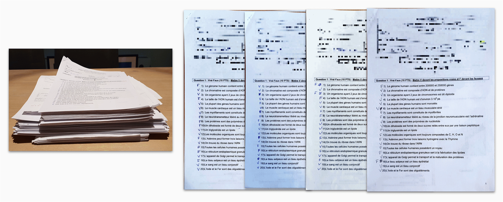
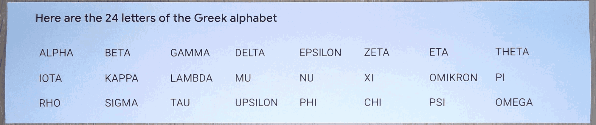
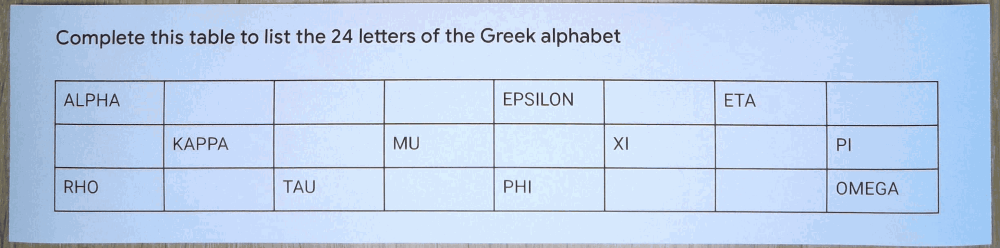
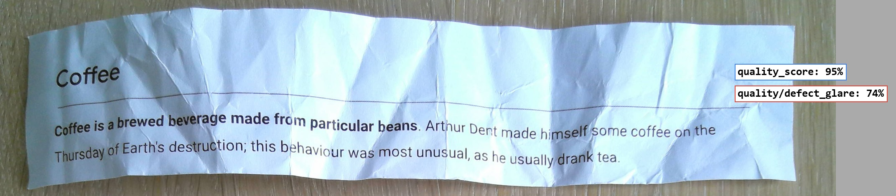
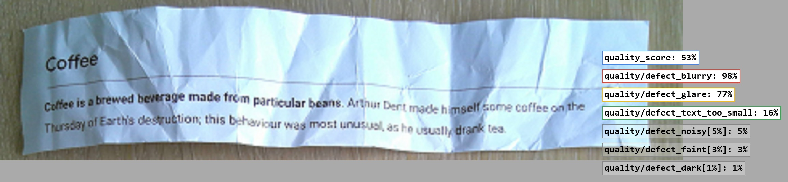
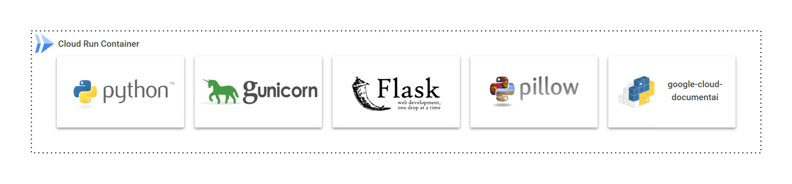
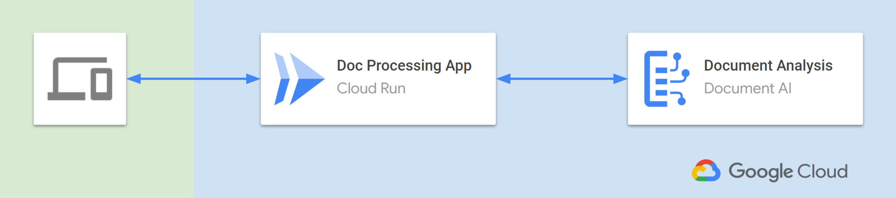

# Powur Demo


### Process Documents


## Confidence scores

We make mistakes, and so can ML models. To better appreciate the structured data you get, results include confidence scores:

- Confidence scores do not represent accuracy.
- They represent how confident the model is with the extracted results.
- They let you — and your users — ponder the model’s extractions.

overlay on top of the page


the resulting data can then be fed directly into a database in Json Format, to be implemented into Powur OS or any other data store. (such as Google Sheets, Google Buckets, or Azure Cloud Storage for example)


```jsonc
{ // document.pages[0].tokens[71].layout
  "text_anchor": {
    // "42\n" ← document.text[351:354]
    "text_segments": [ { "start_index": "351", "end_index": "354" } ]
  },
  // 57% ← Confidence that this token is "42"
  "confidence": 0.57
}
```

Although all text is correctly transcribed in the presented examples, this won't always be the case depending on the input document. However, by sending all results below a certain confidence threshold for manual review, invalid data becomes a thing of the past. 

In addition to interpretting its own confidence, whenever a document is rejected due to low confidence, once that document has been manually reviewed, it can then be re-submitted to the ML model which allows it to learn from its mistakes, and improve exponentially over time. 

## Form fields

The "Form Parser" processor lets you detect form fields. A form field is the combination of a field name and a field value, also called a key-value pair.

In this example, printed and handwritten text is detected as seen before:


In addition, the form parser returns a list of `form_fields`:

```jsonc
{ // document
  "text": "My name:\nDEEP THOUGHT\nYour question: What is the answer to the ultimate question?\nMy answer:\n42\n",
  "pages": [
    {
      "page_number": 1,
      "dimension": {/*…*/},
      "layout": {/*…*/},
      "detected_languages": [/*…*/],
      "blocks": [/*…*/],
      "paragraphs": [/*…*/],
      "lines": [/*…*/],
      "tokens": [/*…*/],
      "form_fields": [/* NEW */],
      "image": {/*…*/}
    }
  ]
}
```

Here is how the detected key-value pairs are returned:

```jsonc
{ // document.pages[0]
  "form_fields": [
    { // "My name:\n"
      "field_name":  { "text_anchor": {/*…*/}, "confidence": 0.96 /*,…*/ },
      // "DEEP THOUGHT\n"
      "field_value": { "text_anchor": {/*…*/}, "confidence": 0.96 /*,…*/ }
    },
    { // "Your question: "
      "field_name":  { "text_anchor": {/*…*/}, "confidence": 0.98 /*,…*/ },
      // "What is the answer to the ultimate question?\n"
      "field_value": { "text_anchor": {/*…*/}, "confidence": 0.98 /*,…*/ }
    },
    { // "My answer:\n"
      "field_name":  { "text_anchor": {/*…*/}, "confidence": 0.76 /*,…*/ },
      // "42\n"
      "field_value": { "text_anchor": {/*…*/}, "confidence": 0.76 /*,…*/ }
    }
  ]
}
```


Note: Form fields can follow flexible layouts. In this example, keys and values are in a left-right order. You'll see a right-left example next. Those are just simple arbitrary examples. It also works with vertical or free layouts where keys and values are logically (visually) related.


Being able to analyze forms can lead to huge time savings, by consolidating — or even autoprocessing — content for you.
The preceding checkbox detection example was actually an evolution of a prior experiment to autocorrect my wife's pile of exam copies.
The proof of concept got better using checkboxes, but was already conclusive enough with True/False handwritten answers. Here is how it can autocorrect and autograde:



## Tables

The form parser can also detect another important structural element: tables.

In this example, words are presented in a tabular layout without any borders. The form parser finds a table very close to the (hidden) layout. Here are the detected cells:



In this other example, some cells are filled with text while others are blank. There are enough signals for the form parser to detect a tabular structure:



When tables are detected, the form parser returns a list of `tables` with their rows and cells. Here is how the table is returned:

```jsonc
{ // document.pages[0]
  "tables": [{
      "layout": {/*…*/},
      "header_rows": [{
        // | ALPHA |       |     |     | EPSILON |     | ETA |       |
        "cells": [/*…*/]
      }],
      "body_rows": [{
        // |       | KAPPA |     | MU  |         | XI  |     | PI    |
        "cells": [/*…*/]
      },
      {
        // | RHO   |       | TAU |     | PHI     |     |     | OMEGA |
        "cells": [/*…*/]
      }]
  }]
}
```

And here is the first cell:

```jsonc
{ // document.pages[0].tables[0].header_rows[0].cells[0]
  "layout": {
    // ALPHA\n
    "text_anchor": {/*…*/},
    "confidence": 0.9979,
    "bounding_poly": {/*…*/},
    "orientation": "PAGE_UP"
  },
  "row_span": 1,
  "col_span": 1
}
```

## Specialized processors

Specialized processors focus on domain-specific documents and extract **entities**. They cover many different document types that can currently be classified in the following families:

- **Procurement** — receipts, invoices, utility bills, purchase orders,…
- **Lending** — bank statements, pay slips, official forms,…
- **Identity** — national IDs, driver licenses, passports,…
- **Contract** — legal agreements

For example, procurement processors typically detect the `total_amount` and `currency` entities:

```jsonc
{ // document
  "entities": [
    {
      "text_anchor": {/*…*/},
      "type_": "total_amount",
      "mention_text": "15",
      "confidence": 0.96,
      "page_anchor": {/*…*/},
      "id": "0"
    },
    {
      "text_anchor": {/*…*/},
      "type_": "currency",
      "mention_text": "USD",
      "confidence": 0.95,
      "page_anchor": {/*…*/},
      "id": "1"
    }
  ]
}
```


## Entity normalization

Getting results is generally not enough. Results often need to be handled in a post-processing stage, which can be both time consuming and a source of errors. To address this, specialized processors also return normalized values when possible. This lets you directly use standard values consolidated from the context of the whole document.

Let's check it with this other receipt:


First, the receipt currency is returned with its standard code under `normalized_value`:

```jsonc
{ // document.entities[0]
  "type_": "currency",
  "mention_text": "€",
  "normalized_value": {
    "text": "EUR"
  } //,…
}
```

Then, the receipt is dated `11/12/2022`. But is it Nov. 12 or Dec. 11? Document AI uses the context of the document (a French receipt) and provides a normalized value that removes all ambiguity:

```jsonc
{ // document.entities[1]
  "type_": "receipt_date",
  "mention_text": "11/12/2022",
  "normalized_value": {
    "text": "2022-12-11",
    "date_value": {
      "year": 2022,
      "month": 12,
      "day": 11
    }
  } //,…
}
```

Likewise, the receipt contains a purchase time, written in a non-standard way. The result also includes a canonical value that avoids any interpretation:

```jsonc
{ // document.entities[5]
  "type_": "purchase_time",
  "mention_text": "12h42\n",
  "normalized_value": {
    "datetime_value": {
      "hours": 12,
      "minutes": 42
    }
  } //,…
}
```

Normalized values simplify the post-processing stage:

- They provide standard values that are straightforward to use (e.g. enable direct storage in a data warehouse).
- They prevent bugs (esp. the recurring developer mistakes we make when converting data).
- They remove ambiguity and avoid incorrect interpretations by using the context of the whole document.

## Entity enrichment

Did you notice there was more information in the receipt?


- _"Maison Jeanne d'Arc, Place de Gaulle"_ mentions a Joan of Arc's House and a place name. Nonetheless, there is no address, zip code, city, or even country.
- This receipt comes most likely from a museum in France, but Joan of Arc lived in a few places (starting with her birthplace in the Domrémy village).
- So, which location does this correspond to?
- A manual search should give hints to investigate, but can we keep this automated?

Extracting the information behind the data requires extra knowledge or human investigation.
An automated solution would generally ignore this partial data, but Document AI handles this in a unique way.
To understand the world's information, Google has been consistently analyzing the web for over 20 years.
The result is a gigantic up-to-date knowledge base called the Knowledge Graph.
Document AI leverages this knowledge graph to normalize and enrich entities.

First, the supplier is correctly detected and normalized with its usual name:

```jsonc
{ // document.entities[6]
  "type_": "supplier_name",
  "normalized_value": {
    "text": "Maison de Jeanne d'Arc"
  } //,…
}
```

Then, the supplier city is also returned:

```jsonc
{ // document.entities[8]
  "type_": "supplier_city",
  "normalized_value": {
    "text": "Orléans"
  } //,…
}
```

Note: Joan of Arc spent some time in Orléans in 1429, as she led the liberation of the besieged city at the age of 17 (but that's another story).

And finally, the complete and canonical supplier address is also part of the results, closing our case here:

```jsonc
{ // document.entities[7]
  "type_": "supplier_address",
  "normalized_value": {
    "text": "3 Pl. du Général de Gaulle\n45000 Orléans\nFrance"
  } //,…
}
```

Enriched entities bring significant value:

- They are canonical results, which avoids information conflicts and discrepancies.
- They can add information, which prevents ignoring useful data.
- They can complete or fix partially correct data.
- In a nutshell, they provide information that is reliable, consistent, and comparable.

Here is a recap of the expected — as well as the non-obvious — entities detected in the receipt:

## Invoices

A few remarks:

- The relevant information is extracted (even the supplier tax ID is detected on the 90°-rotated left side).
- As seen earlier with the expense parser, the invoice parser extracts many `line_item/*` entities but also `supplier_*` and `receiver_*` info.
- This is a typical invoice (issued by the historical French energy provider) with many numbers on the first pages.
- The original source is a PDF (digital) that was anonymized, printed, stained, and scanned as a PDF (raster).


## Identity documents

Identity processors let you extract ID information from identity documents . In this US passport, the expected fields can be automatically extracted:


## Document signals

Some processors return information relative to the document itself.

For example, it can return quality scores for the document, estimating the defects that might impact the accuracy of the resulting data.

The preceding crumpled paper example gets a high quality score of 95%, with glare as a potential defect:



The same example, at a 4x lower resolution, gets a lower quality score of 53%, with blurriness detected as the main potential issue:



- A low score allows you to flag documents that might require a manual review (or a new/better quality submission).
- This would greatly improve the overall speed of the application time-frame. The document would be reviewed instantly, 24/7, and based on the results, could potentially trigger a follow up email to the client, eventually without any human intervention. All within less than 30 seconds of receiving the document. 

- Surprisingly, the exact same text is correctly extracted in both cases, but that might not always be the case.
- The quality scores are returned both as entities (with a `quality_score` parent entity) and in the `image_quality_scores` field at the page level.

Here's how the image quality scores are returned at the page level:

```jsonc
{ // document.pages[0]
  "image_quality_scores": {
    "quality_score": 0.53,
    "detected_defects": [
      { "confidence": 0.98, "type_": "quality/defect_blurry" },
      { "confidence": 0.77, "type_": "quality/defect_glare" },
      { "confidence": 0.16, "type_": "quality/defect_text_too_small" },
      { "confidence": 0.05, "type_": "quality/defect_noisy" },
      { "confidence": 0.03, "type_": "quality/defect_faint" },
      { "confidence": 0.01, "type_": "quality/defect_dark" }
    ]
  }
}
```

## Custom processor

This OCR machine learning model has been custom trained with roughly 50 total utility bills combined, between the 3 UB providers (). each additional UB which is manually reviewed, corrected or confirmed, and re-subbmitted to the OCR processor will make the processor more and more accurate, not just improving, but actually learning what data you are looking for, even on a completely new bill which it has never seen previously. (try it out with a random bill from a different company, but bear in mind, the model's training data is still extremely limited, and therefore will surely have many mismatched fields. (like UB company name as the customer name etc)

With less than 10 manually corrected documents from each new document variation, the model can be "uptrained" at which time the overall accuracy of all the documents it has read since its inception are re-evaluated. 

This allows the overall confidence/accuracy of the model to be tracked as it improves over time.

So far, I only trained it with 50 or so bills, since thats all I had access to from searching online. 
The very best data to use would be the documents from real clients, since some of the document used were a little dated.


## Performance

To finetune your solution and get more accurate, faster, or consistent results, consider the following:

- Check the performance of your solution with worst-case documents at different resolutions.

- Test your solution with actual documents (as close as possible to what you'll have in production). Also, as the ML models are trained on real documents, you may get better results when testing real documents.
- Evaluate whether capturing at a higher resolution and then downscaling produces better results.

## Demo Info

- A frontend using vanilla JavaScript, responsible for managing user interactions and input documents

- A backend using the Python client library, responsible for all document processings and renderings

- Real time processing requests sent to and received from the processor

- Currently, there is no data being stored server side, to avoid storing personally identifiable information, (not that the training dataset was Powur clients data anyway)

-Thus far, all data in the current dataset was aquired from public search results. None of the was from Powur Customers.


Here is the chosen software stack based on open-source Python projects:



One possible architecture to deploy to production is using Google Cloud Run 
(which is a 'serverless' deployment service which offer easy deployment in a few clicks, as well as limitless scalability.

-While still offering extremely fast response times, it also provides the ability to be run on-demand, where server resources are not used unless the OCR is actively processing new data. 




## ! PLEASE NOTE ! ##

It takes seconds to analyze a document. I encourage you to try it out.

Remember though, that the training set is still extremely small, and currently, the processor can only be tested (with an level of accuracy) on California SCE, SDGE, and PGE UBs. 

That narrow use-case could be expanded rather quickly and without much additional effort, not only for use on other Utility bills, but every other variation of documents you can think of.

